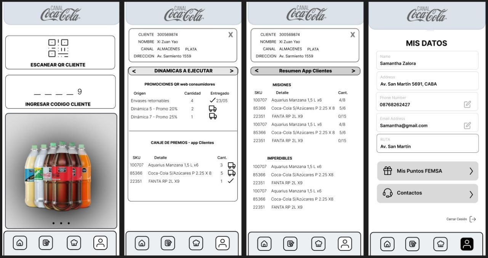

# Prueba técnica - b.live

### Indice:

<ul>
<li> <a href="#intro">- Intro</a>
<li> <a href="#obj">- Objetivos del Proyecto</a></li>
<li> <a href="#stack">- Stack de tecnologias</a></li>
<li> <a href="#instrucciones">- Instrucciones para comenzar</a></li>
<br>
<li> <a href="#back">- Backend</a>
  <ul>
    <li><a href="#endpoints">Endpoints</a></li>
  </ul>
</li>
<li> <a href="#front">- Frontend</a></li>
</ul>

<span id="intro"></span>

## Intro

En este coding challenge el objetivo es crear una app unicamente para mobiles que replique el funcionamiento del actual "Canal Coca Cola"(aplicacion exclusiva para vendedores de la linea de productos "Coca Cola"):
Ejemplo a replicar:

<p align="left"><p>
<span id="obj"></span>

### Objetivos del Proyecto:

- Construir el frontend en React que muestre la información expuesta por la API sobre los clientes de cada usuario en el backend.
- Implementar una pantalla de inicio de sesión que permita el acceso mediante el código de usuario extraído de una "base de datos" simulada en formato JSON.
- Proporcionar la opción de inicio de sesión mediante el escaneo de un código QR que contenga el código de usuario correspondiente.
- Al autenticarse, renderizar los datos de canjes y estadísticas de cada cliente asociado al usuario.
- Crear una pantalla de perfil del usuario donde se pueda visualizar y editar la información personal.

<span id="stack"></span>

### Stack

- Next.js
- Tailwind CSS
- Git

  <span id="instrucciones"></span>

### Iniciar:

1.  En la carpeta raiz crear un archivo llamado: `.env.local` que tenga la siguiente variable de entorno:
    `NEXT_PUBLIC_SECRET_TOKEN = secret-token` (\*)

2.  Instalar dependecias ingresando en nuestro terminal el comando segun empaquetador:

```bash
- npm install
- pnpm install
- yarn install
```

3. Inicializar ingresando el comando segun empaquetador:

```bash
- npm run dev
- pnpm run dev
- yarn dev

```

(\*) La variable de entorno "NEXT_PUBLIC_SECRET_TOKEN" simula un token para poder acceder a la ruta de usuarios.

# Backend

<span id="endpoints"></span>

## Endpoints

URL: https://coca-cola-app-challenge.vercel.app/

| Método | Endpoint                       | Descripción                   | Headers                     |
| ------ | ------------------------------ | ----------------------------- | --------------------------- |
| GET    | /api/users                     | Traer todos los usuarios      | Authorization: secret-token |
| GET    | /api/users?password={password} | Traer un usuario con password | Authorization: secret-token |
| GET    | /api/clients                   | Traer todos los clientes      | -                           |
| GET    | /api/clients?id={id}           | Traer un cliente por id       | -                           |
| GET    | /api/products                  | Traer todos los productos     | -                           |
| GET    | /api/products/missions         | Traer todas las misiones      | -                           |
| GET    | /api/products/unmissables      | Traer todos los imperdibles   | -                           |

# Frontend

<span id="recorrido"></span>

## Recorrido:

<span id="login"></span>

### Login:

-
